# Redes virtuales en Azure

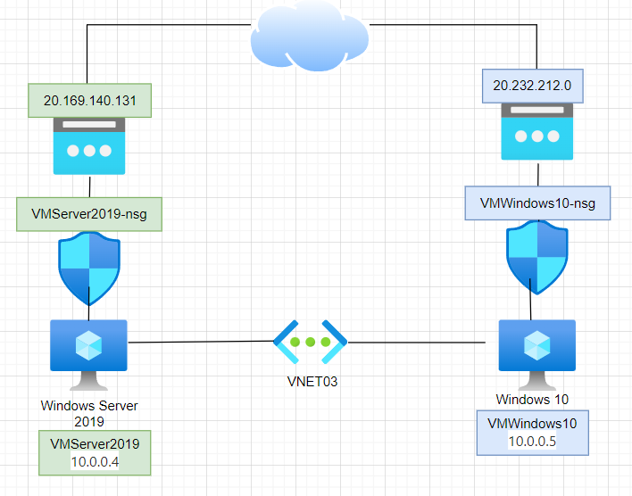

Los pasos para dar respuesta a la siguiente necesidad

## Paso 1. Creación de nuestro grupo de recursos

Para empezar, debemos crear el grupo de recursos. Para ello, nos dirigimos al portal de Azure y una vez dentro vamos a Resocurce Groups > Create, y elegimos el nombre que queramos darle a nuestro grupo. En nuestro caso será el de "RG-PracticaVR". Por último, le damos a revisar y a crear.

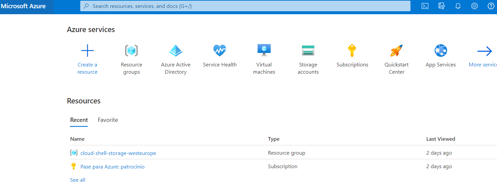

## Paso 2. Creación de la VM Windows Server 2019

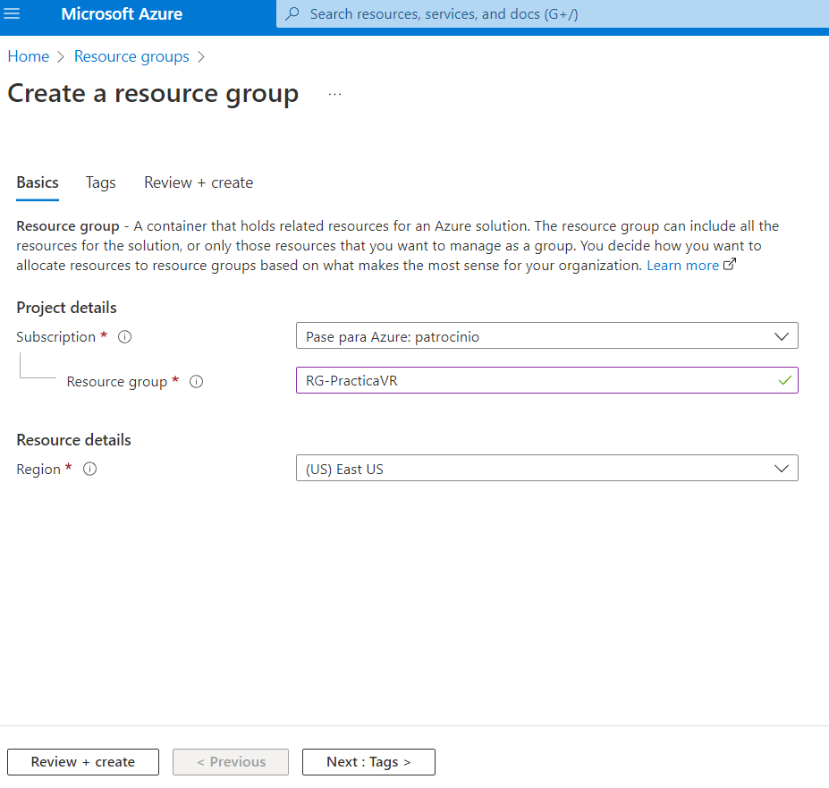
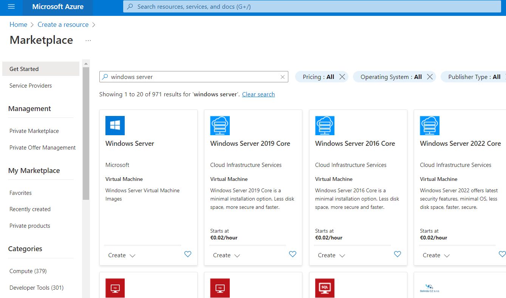

Para crear la maquina virtual debemos dirigirnos al Marketplace de Azure y buscar Windows Server. Elegimos la primera opcion que nos aparece y procedemos a crear la máquina. Elegimos el plan de Windows Server DataCenter y continuamos creando la máquina.

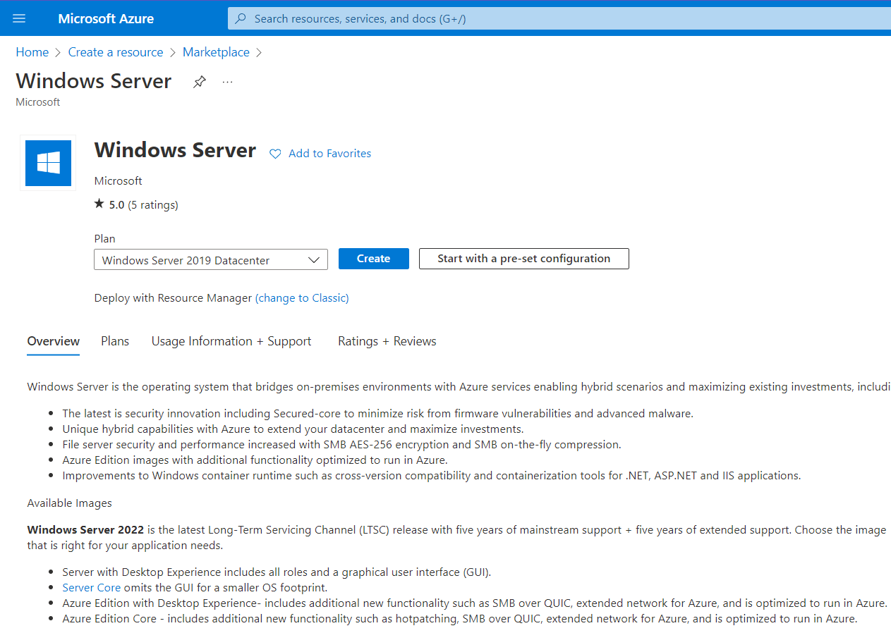

 con los siguientes ajustes:

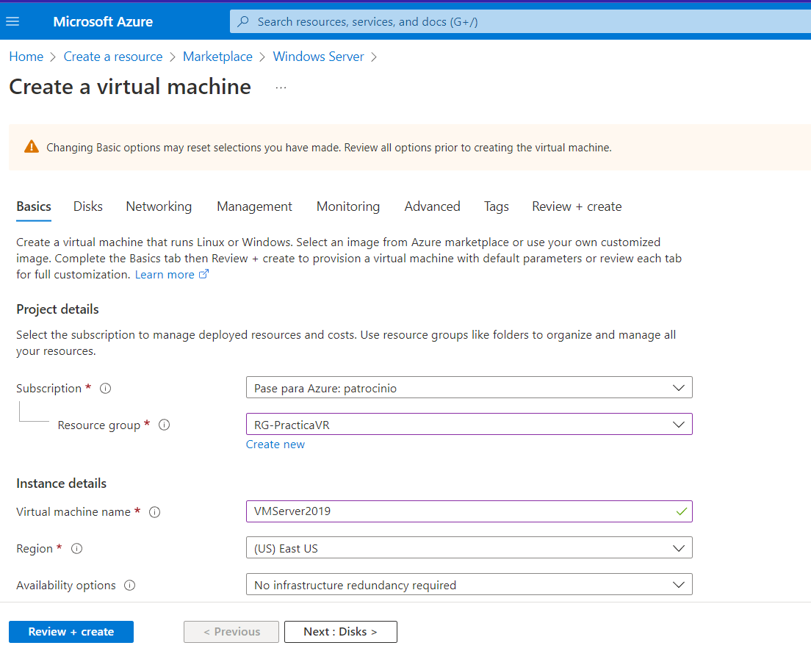
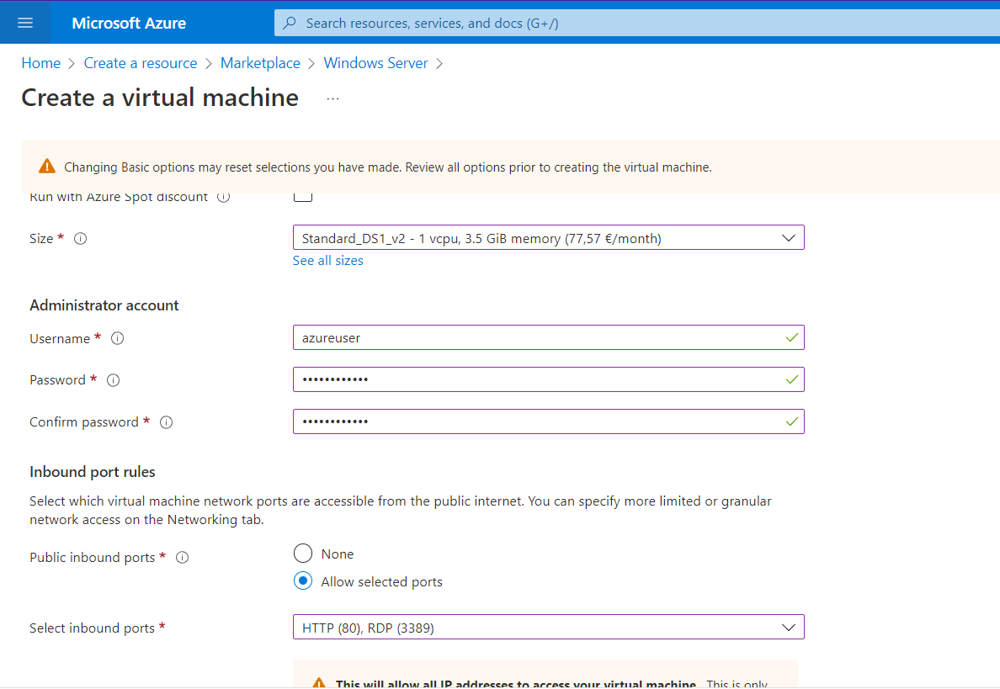

### Subpaso 1

En el apartado de los puertos, debemos marcar el 80 y el 3398. En Disks, elegiremos SSD Standard. En Networking tenemos que crear una nueva red, la cual llamaremos Vnet03 y pondremos el rango de Red en /20 y en la Subnet pondremos un rango /24.
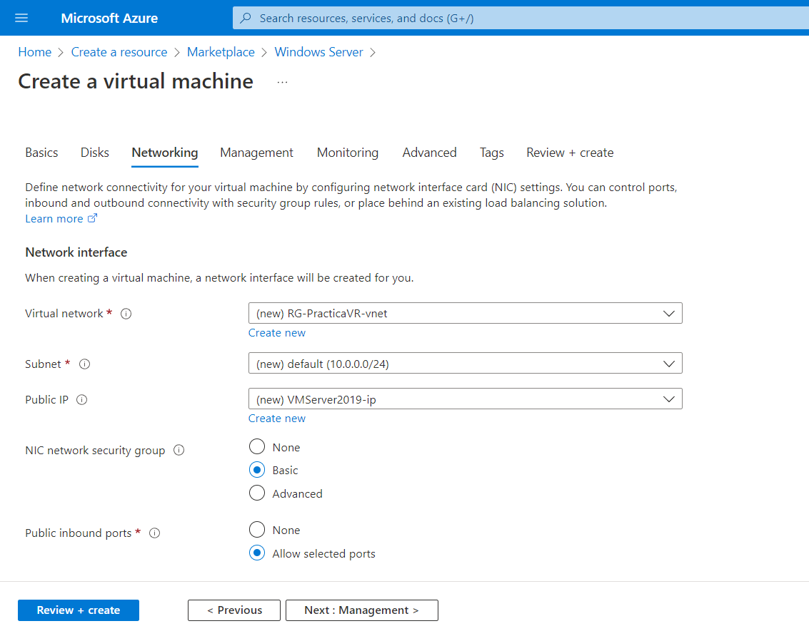
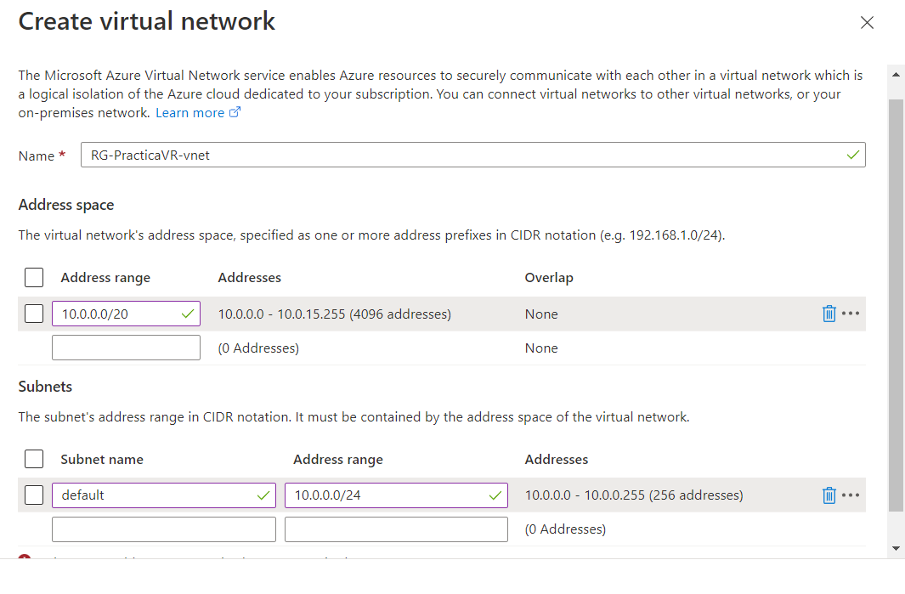

Espacio de direccion 10.0.0.0/20
Subneting 10.0.0.0/24

### Subpaso 2 Creacion Ip publica

WS2019ip/standard/static/Microsoft Network Routing

### Subpaso 3
NSG (Network Security Group)
Abriremos puerto 80 (HTTP) y 3389 (RDP)
Marcamos la opción de "Delete public IP and NIC when VM is deleted."
El resto de ajustes lo dejamos por defecto.
En Tag, crearemos etiquetas segun nuestras necesidades. Por ejemplo, Departamento y Marketing.
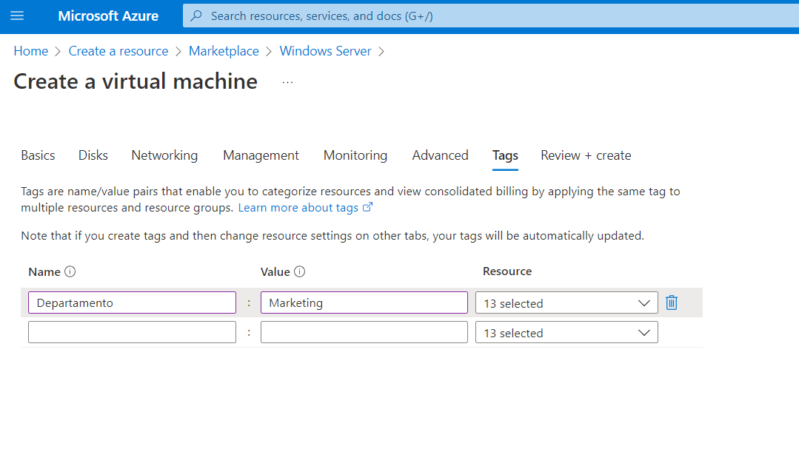

Por ultimo, revisamos y creamos la VM Windows Server 2019. Una vez creada podemos ver que la máquina está funcionanodo e incluso podemos conectar con ella.
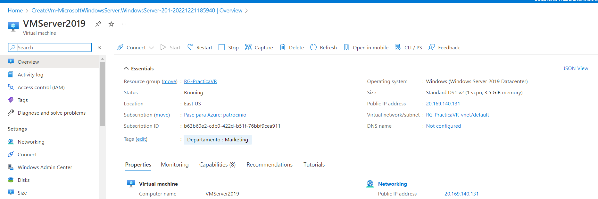

## Paso 3 Creación de VM Windows 10

Para crear la maquina virtual debemos dirigirnos Resource Groups que hemos creado antes e ir a crear una maquina virtual. Una vez dentro, elegimos Windows 10 y seleccionamos los siguientes ajustes:

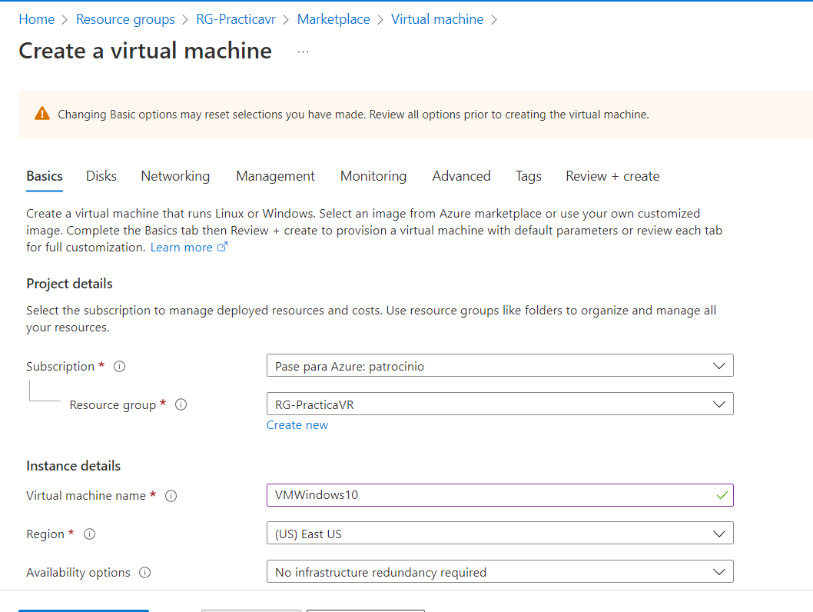

### Subpaso 1

En el apartado de los puertos, debemos marcar el 3398. En Disks, elegiremos SSD Standard. En Networking tenemos que elegir la red que hemos creado antes como Vnet03. Tambien lo relacionaremos con el subnet que hemos visto antes en la creación del Windows Server 2019.

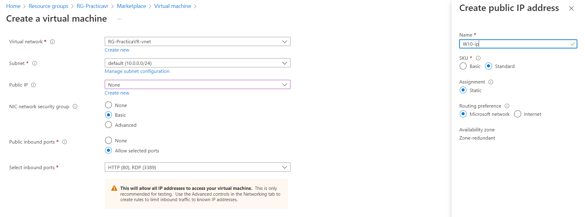

Espacio de direccion 10.0.0.0/20
Subneting 10.0.0.0/24

### Subpaso 2 Creación de Ip pública

W10-ip/standard/static/Microsoft Network Routing

### Subpaso 3
NSG (Network Security Group)
Abriremos solo el puerto 3389 (RDP)
Marcamos la opción de "Delete public IP and NIC when VM is deleted."
El resto de ajustes lo dejamos por defecto.
En Tag, crearemos etiquetas segun nuestras necesidades. Por ejemplo, Departamento y Marketing.

Por ultimo, revisamos y creamos la VM Windows 10.

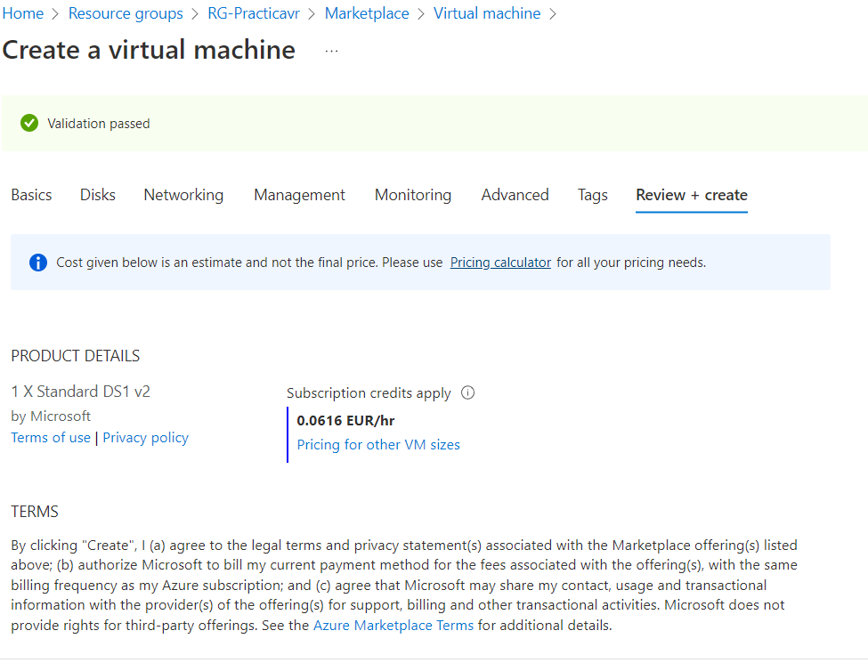

Una vez creada podemos ver que la máquina está funcionanodo e incluso podemos conectar con ella.

## Paso 4 Conexión con Admin center

msiexec -i WindowsAdminCenter2211.msi productLanguage="1033"
El comando anterior lo utilizaremos si hay diferencias con el Windows, su lenguaje y el Admin Center.
Añadido Admin Center al AD Azure. (Inicio de seción en Azure desde Admin Center)

Habilitado los puertos de gestión de admin center en Windows 2019 maquina virtual

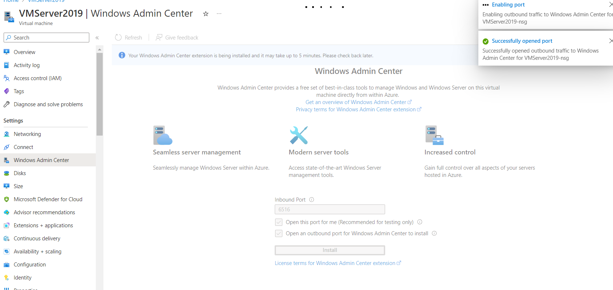

Revisar la pertenencia al role "Windows Admin Center Administrator Login" role 

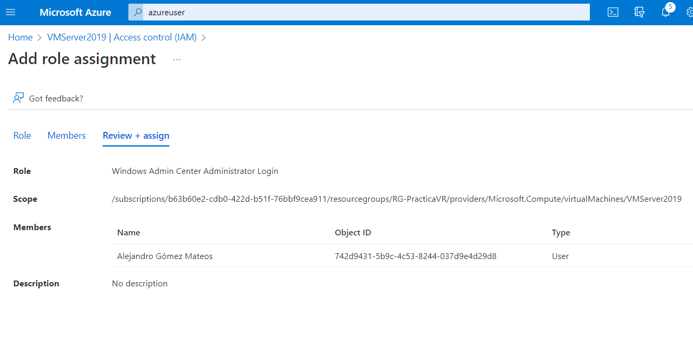

Ahora ya tenemos añadidas ambas redes (W10 y WS2019)

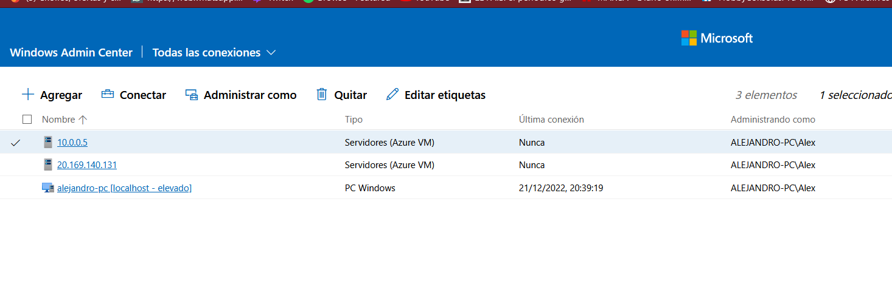

### Sub paso 1
Alternativa de gestion con server manager

Añadido un rol de Web Server (IIS)

Comprobado la pagina de inicio

CD C:\inetpub\wwwroot

Añadido un mensaje en la pagina de inicio

